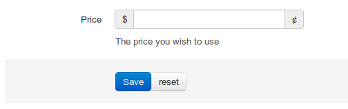

So...

With the release of beta 5 for Zend Framework 2 I thought it time for me to tidy up and fix a few modules I created back at beta 3.

Now I'm a big fan of Twitter Bootstrap CSS framework as I'm sure a lot of other people are as well. Seeing that the Zend Skeleton Application comes with bootstrap already included it was easy enough to set up my forms using the old ZF Forms found in ZF1.

However a brand spanking new Forms component has been rolled out with ZF2. The long and the short of this new component meant that I had the opportunity to hand roll a new way of making my forms work with Twitter Bootstrap.

So, a little tinkering, a quick [pull request](https://github.com/zendframework/zf2/pull/1893) to ZF2 to allow the definition of arbitrary options and I came up with some useful View Helpers that can be dropped into a project and used.

You can find them at [https://github.com/zucchi/Zucchi](https://github.com/zucchi/Zucchi/tree/master/src/Zucchi/Form/View/Helper "https://github.com/zucchi/Zucchi").

So how to use them. Lets start by creating a new form (we'll keep it simple for now) <!--more-->

```
class MyForm extends Form
{
    public function __construct()
    {
        parent::__construct('myform');
        $this->add(array(
            'name' => 'price',
            'attributes' => array(
                'type' => 'text',
                'required' => 'required',
                'placeholder' => '0.99',
            ),
            'options' => array(
                'label'
                'bootstrap' => array(
                    'help' => array(
                        'style' => 'block'
                        'content' => 'The price you wish to use'
                    ),
                    'prepend' => array('$'),
                    'append' => array('¢'),
                ),
            ),
        );

        $actions = new Collection('actions');
        $actions->setAttribute('class', 'form-actions');

        $actions->add(array(
            'name' => 'submit',
            'attributes' => array(
                'type' => 'submit',
                'value' => 'Save',
                'class' => 'btn btn-primary'
            ),
            'options' => array(
                'bootstrap' => array(
                    'style' => 'inline',
                ),
            ),
        ));

        $actions->add(array(
            'name' => 'reset',
            'attributes' => array(
                'type' => 'reset',
                'value' => 'reset',
                'class' => 'btn'
            ),
            'options' => array(
                'bootstrap' => array(
                    'style' => 'inline',
                ),
            ),
        ));
        $this->add($actions);
    }
}
```

You'll notice that I have highlighted some lines. Thanks to the ability to set arbitrary options we can define a "bootstrap" option which we can then use to allow us to pass data into our new bootstrap view helpers. You can also see that I have added a save and reset button to a collection. I'll explain that later.

So what next... Rather than go into the mechanics of how to work with forms I'll refer you to [the ZF documentation](http://zend-framework-2-doc.readthedocs.org/en/latest/modules/zend.form.intro.html "the ZF documentation") and this excellent [blog post](http://www.michaelgallego.fr/blog/?p=190 "New Zend\Form features explained")

We then pick up by looking at your view, and the helpers I have created.

## BootstrapForm($form, $formStyle)

One of the few things I miss from the ZF1 implementation of Forms is the self rendering aspect! So what did I decide to do? That's right I created a view helper to render everything in one command.

The `$this->bootstrapForm()` takes two parameters. The first is quite obviously the form. The second is the style of form. This is directly related to the form types that can be found [http://twitter.github.com/bootstrap/base-css.html#forms](http://twitter.github.com/bootstrap/base-css.html#forms "here"). You can use any of 'vertical', 'inline', 'search' & 'horizontal'. If you dont specify a formStyle then it will default to 'vertical'

Caveat: This helper will then iterate through all of the associated elements and render them first. Only after the direct elements have been generated will it then move onto Collections or Fieldsets (as soon as I work out how I'll fix this).

## BootstrapRow($element, $formStyle)

This is a straightforward modification of the `FormRow` helper that come bundled with the new component.

We have a few differences now though. We have a second parameter as with the `BootstrapForm` view helper and the output is generated using sprintf and a set of templates that mimic the structures of the different form styles from bootstrap.

This helper can be used by itself to generate an element row and is used by the `BootstrapForm` helper

We can also now take advantage of the "bootstrap" options we set earlier.

### Bootstrap Options

style

The style of form element to use regardless of what style may be passed into the view helper (you can see an example of this in the buttons from the MyForm example above)

help

This works in the same way as "description" did from ZF1 but allows you to define it either as a string or an array with the keys "style" for either 'inline' or 'block' and "Content" which should be self explainatory

prepend

Takes advantage of Bootstraps ability to prepend blocks to an input field. This can be defined as a single string, or an array of strings to allow you to add multiple blocks should you want to

prepend

Takes advantage of Bootstraps ability to append blocks to an input field. This can be defined as a single string, or an array of strings to allow you to add multiple blocks should you want to

These options get evaluated and spat out from the new `renderBootstrapOptions()` method as part of the "render".

## BootstrapCollection($element, $style, $wrap)

Again this is a direct rip off of the `FormCollection` helper found in the ZF2 Form component witha few modifications. The main difference is that is makes use of the `BootstrapRow` helper and has methods and properties to allow the setting of the form style to use.

You can see from the `MyForm` example above that we set a `Collection` called 'actions'. This is a pretty standard way of grouping elements together. You can also see that we set a class for the `Collection` which may look familiar to those that have used Twitter Bootstrap for a while.

What our helper will then do is wrap the buttons in a div with the appropriate class attached. If you were to define a `label` for the Collection/Fieldset You would then also find that the fieldset and legend tags are also spat out with our `<div class="form-actions">` sandwiched between them and the elements.

### Result

So what we now get when we use `MyForm` with out helpers.

```
$this->bootstrapForm($form, 'horizontal');
```

Should now look something like this

[](http://phpboyscout.uk/wp-content/uploads/2012/07/bootstrap-result1.png)

### How you can use it

As of right now you can get the library from its repo on github @ [https://github.com/zucchi/Zucchi](https://github.com/zucchi/Zucchi) and can be found on [packagist](http://packagist.org/packages/zucchi/zucchi "zucchi/zucchi") for use with composer

**Edit:** The bootstrap stuff has moved to a new location as a separate ZF2 module. you can find it @ [https://github.com/zucchi/ZucchiBootstrap](https://github.com/zucchi/ZucchiBootstrap) or @ [packagist](http://packagist.org/packages/zucchi/bootstrap "zucchi/bootstrap") for use with composer
