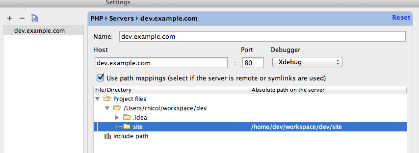
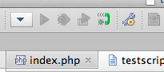

This was a head scratcher when I ran into this yesterday and I thought I would share my solution to the following scenario:

**_I need to debug PHP Command Line script, located on Remote LAMP Virtual WebServer running in Virtual Box with a Shared Folder, using local PHPStorm 5.0._**

The solution:

<!--more-->

You first must set PHPStorm to use remote file paths. To set these go to the following:

**PHPStorm -> Peferences -> PHP -> Servers**

This gives the following display:

[](http://phpboyscout.uk/wp-content/uploads/2013/02/PHPStorm-Peferences.png)

Replace the Name, Host and Absolute path on the server, to match your own settings. Note keep the Name and Host the same for ease.

Next add some breakpoints in PHPStorm and set it to listen for any debug connections using the listener icon:

[](http://phpboyscout.uk/wp-content/uploads/2013/02/Listen-to-debug-connections.png)

Now login to your Remote Server via SSH etc.

You now need to change settings for Xdebug in either xdebug.ini or php.ini depending on how you installed it. You also need to know the IP of the local machine. This can permanently set in the Network Setting of your VM in Virtual Box, so you will never have to change it. In my example the local machine running PHPStorm is:

**192.168.56.1**

Now edit the ini file that contains your Xdebug settings and set the following:

```
xdebug.remote_host = 192.168.56.1
xdebug.remote_connect_back = 0
xdebug.remote_port = 9000
xdebug.remote_handler = dbgp
xdebug.remote_mode = req
xdebug.remote_enable = 1
xdebug.idekey = phpstorm1
```

Be aware you might have to change the **remote\_host** and the **idekey** based on your own environment. To better understand what each option does, see [Xdebug Settings](http://xdebug.org/docs/all_settings "Xdebug Settings")

Finally, when running the script you must set the following variables:

```
PHP_IDE_CONFIG="serverName=dev.example.com"
```

PHP\_IDE\_CONFIG will tell PHPStorm how to map the Remote File Paths to what it sees Locally. Again replace the URL with the Name/Host you set in PHPStorm. **Note:** You can export this, if your system is only running one site; mine is not.

You can run this inline with your script:

```
PHP_IDE_CONFIG="serverName=dev.example.com" ./testscript.sh
```

This should send you to PHPStorm where you earlier placed breakpoints.

Happy Debugging!
