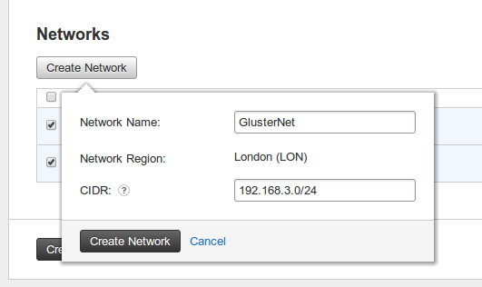
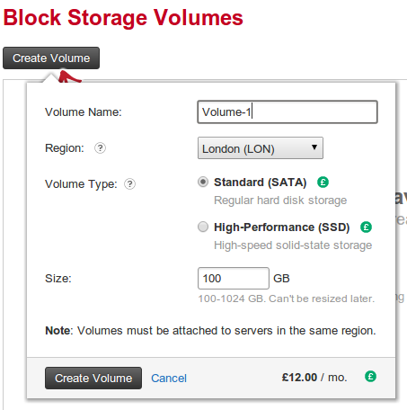
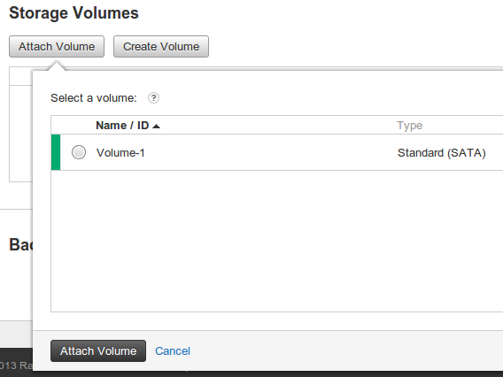
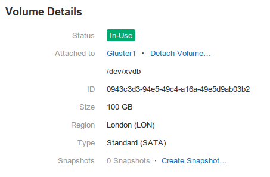

A few of our projects recently called for a distributed file-system that provided high availability and redundancy. After a tip off from a fellow techie and a quick browse around the net it appeared that a solution called GlusterFS appeared to tick all the boxes for what we were wanting.

However setting it up turned out not to be as trivial as I had originally anticipated. I'm going to try and put down the process we have evolved for setting it up on Ubuntu in the cloud

<!--more-->

A couple of things to clear up first.

1. We are using Rackspace for our cloud but beyond the setup of the servers it should still be relevant
2. There are a number of ways to interact with Rackspaces set up but for this we are going to use the cloud control panel
3. We use Ubuntu as our preferred server which means that our config tends to be all over the place compared to other guides
4. You will need to set up a minimum of 2 servers and a separate block storage device for each.
5. We have set up and broken a few different variations of gluster setup so far and make no guarantees that the setup in this blog is infallable but its the best wehave so far.

## Setting up the hardware

First things first. We are going to need to set up are some servers.

Feel free to create any size server you want. Just make sure to select Ubuntu 12.10 (or whatever version you may have that is newer).

You will also need to define a new network to work with. We use this to isolate the traffic between the nodes of our new gluster.

You can create a new network when creating the first of your servers. On the creation page under the networks heading you can find a "Create Network" button.

[](http://phpboyscout.uk/wp-content/uploads/2013/03/create-network.png)Hopefully this should be quite self explanatory. Now when you create subsequent servers you will then have the option to attach your new network ("GlusterNet" in my example).

Once the two starting nodes have been created then you need to add some additional block storage to store your data on. Make sure that you create blocks that have sufficient capacity for your needs. Something else to consider is using High Performance SSD storage. Its a little on the pricy side but well worth the expense if you are trying to eak out every ounce of performance from the implementation.

[](http://phpboyscout.uk/wp-content/uploads/2013/03/block-storage.png)

You will then need to attach one to each of your servers.

[](http://phpboyscout.uk/wp-content/uploads/2013/03/attach-storage.png)

Once attached you will be able to see the details of the block mount point from the block storage details page.

[](http://phpboyscout.uk/wp-content/uploads/2013/03/storage-details.png)

Make a note of the mount point (in this case "/dev/xvdb") as we will need that in a minute.

## Prepare the Server

Now that we have a the hardware ready we can shell into a server to set it up.

First you need to shell into your server and update its OS as the images provided by most cloud supplier tends not to have the latest patches and updates. In our case it's as simple as:

```
apt-get update 
apt-get upgrade
```

Once that's done we then need to prepare the Block Storage device ( henceforth refered to as a "brick")

if you run fdisk -l  you should see that an entry that looks something like

```
Disk /dev/xvdb: 107.4 GB, 107374182400 bytes
255 heads, 63 sectors/track, 13054 cylinders, total 209715200 sectors
Units = sectors of 1 * 512 = 512 bytes
Sector size (logical/physical): 512 bytes / 512 bytes
I/O size (minimum/optimal): 512 bytes / 512 bytes
Disk identifier: 0x00000000

Disk /dev/xvdb doesn't contain a valid partition table
```

This indicates that our brick needs a partition table and formatting. We can achieve this be doing the following

```
Device contains neither a valid DOS partition table, nor Sun, SGI or OSF disklabel
Building a new DOS disklabel with disk identifier 0xe7da4288.
Changes will remain in memory only, until you decide to write them.
After that, of course, the previous content won't be recoverable.

Warning: invalid flag 0x0000 of partition table 4 will be corrected by w(rite)

Command (m for help): n
Partition type:
   p   primary (0 primary, 0 extended, 4 free)
   e   extended
Select (default p): p
Partition number (1-4, default 1): 1
First sector (2048-209715199, default 2048): 
Using default value 2048
Last sector, +sectors or +size{K,M,G} (2048-209715199, default 209715199): 
Using default value 209715199

Command (m for help): w
The partition table has been altered!

Calling ioctl() to re-read partition table.
Syncing disks.
```

I've highlighted the prompts and my responses. All we are doing here is creating a default partition table that has a single partition which uses up the whole disk.

now running fdisk -l  should give us something that looks like

```
Disk /dev/xvdb: 107.4 GB, 107374182400 bytes
43 heads, 44 sectors/track, 110843 cylinders, total 209715200 sectors
Units = sectors of 1 * 512 = 512 bytes
Sector size (logical/physical): 512 bytes / 512 bytes
I/O size (minimum/optimal): 512 bytes / 512 bytes
Disk identifier: 0xe7da4288

    Device Boot      Start         End      Blocks   Id  System
/dev/xvdb1            2048   209715199   104856576   83  Linu
```

As you can now see we have a valid device of  /dev/xvdb1 that we can mount_._ However we need to create a valid filesystem on the new brick before we can mount it. I have been doing this with Ext4 rather than XFS (which is the recommened filesystem from gluster), this is mainly down to the fact that when i tried using XFS I kept getting some issues with performance and access. I'm sure that with further investigation I could resolve this but as of yet haven't had chance to. So far though I have had zero issues using Ext4. To create the filesystem we run:

```
mkfs.ext4 -j /dev/xvdb1
```

Next, create a folder to mount to, easily done by executing:

```
mkdir -p /glusterfs/brick
```

Finally, the simplest way to mount the device is via your /etc/fstab by adding the line

```
/dev/xvdb1       /glusterfs/brick ext4 defaults 1 2
```

and running mount -a  as root (this will also mean that it mounts on boot for you automatically as well.)

Next we need to install the latest gluster version. At the time of writing this was v3.3.1. You can find a version to suit your OS at [http://www.gluster.org/download](http://www.gluster.org/download). If you are using Ubuntu you can do the following

```
apt-get install software-properties-common
add-apt-repository ppa:semiosis/ubuntu-glusterfs-3.3
apt-get update
apt-get install glusterfs-server glusterfs-client
```

By this point you will now have a single working server to continue on your going to need to set up your second server ready to create your new volume.

Once you have your second (or third, fourth, etc) setup its a good idea to add a reference to each one of them to your /etc/hosts  file. This is not really necessary and you can just use the IP addresses of each server but it saves you having to remember each IP and makes it easier to identify.

Remember that we are going to be working with the new network interface you created earlier (i.e "GlusterNet"). to get the IP of your GlusterNet interface a quick ifconfig will show you an interface with an IP that matched the CIDR from earlier. In my case I now have 2 IPs of 192.168.3.1 & 192.168.3.2.

So now I add the following lines to my /etc/hosts  file

```
192.168.3.1 gluster1
192.168.3.2 gluster2
```

## Creating our volume

Now that the servers are prepared we can now play with the the tool gluster.This tool is a life saver in getting everything configured quickly and you can easily get a list of what its capable of by running gluster help. Now Im not going to take you through every command and option and would recomend reading the gluster manual to learn more.

What this tool actually does is help generate and manipulate all the required config that is then stored at /var/lib/glusterd/.

Firstly we need to tell gluster is that we have a pool of servers that will communicate with each other. Gluster refers to these as peers. To do this you need to run gluster peer probe gluster2 on each server for each server that will be used, replacing "gluster2" with the name names you defined in your /etc/hosts  file. This will then create the appropriate files at /var/lib/glusterd/peers/

Now that all our peers have been defined we can get to actually creating the new distributed volume. This however requires a little consideration as there are some decisions you need to make.

If we take a look at the help for creating a new volume we can see that we need to decide on what options to use

```
volume create <NEW-VOLNAME> [stripe <COUNT>] [replica <COUNT>] [transport <tcp|rdma|tcp,rdma>] <NEW-BRICK>
```

1. <NEW-VOLNAME>  - what are we going to name our volume
2. \[stripe <COUNT>\] \[replica <COUNT>\] - are we going to crate a striped or replicated volume and how many "bricks" are we going to create this volume with
3. \[transport {tcp|rdma|tcp,rdma>\] - What transport protocol do you want the peers to communicate with
4. <NEW-BRICK> - which servers/bricks do you want to use.

for more information on how to create you volume and what all the options mean have a look at these links

[http://gluster.org/community/documentation/index.php/Gluster\_3.2:\_Configuring\_Distributed\_Replicated\_Volumes](http://gluster.org/community/documentation/index.php/Gluster_3.2:_Configuring_Distributed_Replicated_Volumes)

[http://gluster.org/community/documentation/index.php/Gluster\_3.2:\_Configuring\_Distributed\_Striped\_Volumes](http://gluster.org/community/documentation/index.php/Gluster_3.2:_Configuring_Distributed_Striped_Volumes)

for our purposes we are going to run

```
gluster volume create myvolume replica 2 transport tcp gluster1:/glusterfs/brick gluster2:/glusterfs/brick
```

This now creates a new volume that spans both of our servers. you can confirm that this is the case by running gluster volume info  and you should get something that looks like

```
Volume Name: myvolume
Type: Replicate
Volume ID: d3dd24fd-9482-44c3-9503-24291fad8193
Status: Created
Number of Bricks: 1 x 2 = 2
Transport-type: tcp
Bricks:
Brick1: gluster1:/glusterfs/brick
Brick2: gluster2:/glusterfs/brick
```

running this on both servers should give you the same results.

What you will now find is that the gluster  command has created a plethora of files at /var/lib/glusterd/vols/myvolume/. As you work with gluster more and more you will find yourself drawn to these files as they control all the different aspects of how the volume works and performs. Most importantly we will need some information from these files when we come to configure a client to mount the volume.

All that is left to do now is start the volume which can be easily done with a quick gluster volume start myvolume

At this point we have now completed setting up our volume but we need to add some security. I would strongly recommend setting up a firewall using ufw to control access to the server. The easiest way to do this is to allow all traffic on your "GlusterNet" network interface as only the servers you attach to that network will have access. you can find a guide to using ufw at [https://help.ubuntu.com/12.10/serverguide/firewall.html](https://help.ubuntu.com/12.10/serverguide/firewall.html).

## Mounting a Client

Now that we have a working volume we need to add some clients. To do this you will need to create a new server as above that is attached to the "GlusterNet" network but without the block storage (unless you really want it that is).

Make sure to add your gluster dfinitions to your /etc/hosts file

Once you have your new client server ready we can install the gluster client

```
apt-get install software-properties-common
add-apt-repository ppa:semiosis/ubuntu-glusterfs-3.3
apt-get update
apt-get install glusterfs-client
```

I've seen a number of different guides that tell you to install glusterfs-server as well but I have as yet had no need to as it all works without it.

Now there are a lot of way that you can mount your new Gluster volume. I have tried a few and have had varying results. What I have found is that the best way is to create a volume file. To do this we create a new file at /etc/glusterfs.vol.

```
volume gluster1
  type protocol/client
  option transport-type tcp
  option remote-host gluster1
  option remote-subvolume /glusterfs/brick
  option username <username>
  option password <password>
end-volume

volume gluster2
  type protocol/client
  option transport-type tcp
  option remote-host gluster2
  option remote-subvolume /glusterfs/brick
  option username <username>
  option password <password>
end-volume

volume replicate
  type cluster/replicate
  subvolumes gluster1 gluster2
end-volume

volume writebehind
  type performance/write-behind
  option cache-size 1MB
  subvolumes replicate
end-volume

volume cache
  type performance/io-cache
  option cache-size 400MB
  subvolumes writebehind
end-volume
```

What you will notice is that there is a <username>  and <password>  required for this to work. You can find these details on one of your peer servers in the file /var/lib/glusterd/vols/myvolume/trusted-myvolume-fuse.vol.

This /etc/gluster.vol file is basically going to inform the gluster-client software about how to connect to the gluster volume and all the available nodes to connect to. This provides us with some level of fail-over so should one node become unavailable the gluster client will seamlessly switch to a different one. It also allows us to define additional "[translators](http://www.gluster.org/community/documentation/index.php/Translators "translators")" such as the [performance-io](http://www.gluster.org/community/documentation/index.php/Translators/performance/io-cache "performance-io") one that you can see here. I would strongly recommend reading through the available translators to see which may be useful to you.

Now one of the main issues you will find with Ubuntu is that it will fail on boot if you try to add this mount to your fstab. To get around this you can use Upstart. if you create the following file at /etc/init/glusterfs-mount.conf  making sure to change <interface>  to the interface for your GlusterNet network (i.e. eth0 or eth1 or eth2, you get the idea)

```
author "Matt Cockayne"
description "Mount GlusterFS after networking available"

start on net-device-up IFACE=<interface>
stop on stopping network
stop on starting shutdown

script
    mount -t glusterfs /etc/glusterfs.vol /glusterfs
end script
```

As you can see we are using a straight mount command. The magic is that this will not be executed until the start clause validates which in this case is not until the network interface for "GlusterNet" is up and running properly. You will also see that we are mounting the /etc/gluster.vol  file to /gluster  (remember to create this folder to mount to) rather than mounting a network path as you might when mounting an NFS share.

If you wanted you could also add more to your upstart script to handle clean un-mounting of gluster thus allowing you to then use the service gluster-mount (start|stop|restart)  commands

A quick reboot of the client server should confirm that it boots successfully and you will now end up with your volume mounted at /gluster. You can now test this by creating a new file. I tend to create an empty file at /gluster/mounted  just so I have a quick reference that the folder is mounted. Once that's created if you now go and take a look at the /gluster/brick  on your "peers" you should see that there is now a file called "mounted" sat there looking all smug that it worked.

## Caveats

Some important things for you to be made aware of

- Never write directly to a brick. Make sure to write to the volume only through a configured client
- Beware of split-brain. [http://community.gluster.org/q/what-is-split-brain-in-glusterfs-and-how-can-i-cause-it/](http://community.gluster.org/q/what-is-split-brain-in-glusterfs-and-how-can-i-cause-it/) [http://www.gluster.org/2012/06/healing-split-brain/](http://www.gluster.org/2012/06/healing-split-brain/)
- RTFM - Read The F\*\*\*ing Manual. Gluster is big and complex and there is a lot for you to understand. You can download a copy of the manual from [here](http://www.gluster.org/wp-content/uploads/2012/05/Gluster_File_System-3.3.0-Administration_Guide-en-US.pdf "PDF")
