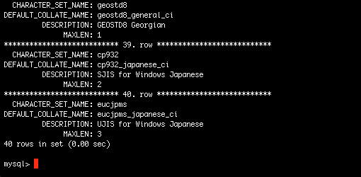

If you ever find yourself using MySQL via command line and end up with something like this:

[](http://phpboyscout.uk/wp-content/uploads/2013/04/mysql-command-line.jpg) And thought there must be another way, well here it is: Use **\\G** instead of **;** at the end of your select command.

For example:

```
select * from CHARACTER_SETS\G
```

Below is an image of the output from this select:

[](http://phpboyscout.uk/wp-content/uploads/2013/04/mysql-nice-output.png)

Happy Querying!
