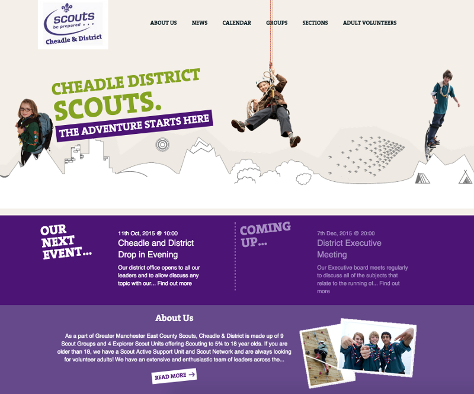

I've been a Scout Leader for a few years now and the District I work within have very little by way of internet presence. As a bit of a pet project I started building a simple Scout based website for them to use.

 <!--more--> Its nothing too fancy, I created a simple module and theme for the Silverstripe CMS and have now put it into a GitHub Repository to share with the wider scouting community.

I chose Silverstripe because of the speed with which I could develop something usable as well as providing a super simple management interface that can be handled by users of all skill levels.

The module itself extends some very common extensions available for the CMS and makes them scout focused. Features include.

- Customisable theme
- Multi tiered Event Calendars
- Customisable Group/Section Pages
- Dynamic Forms
- A reliable News/Blog system

These are just a few of the most obvious features and hopefully I will continue to add more.

I'm also offering to help any Scout Groups/Districts/Counties if they are wanting to use these modules and get their sites built and up and running for them free of charge.

If you want to take a look at the code and have a play yourselves you can find it online at

- [https://github.com/phpboyscout/silverstripe-scouts](https://github.com/phpboyscout/silverstripe-scouts)
- [https://github.com/phpboyscout/silverstripe-scouts-theme](https://github.com/phpboyscout/silverstripe-scouts-theme)

If you want to get in touch or would like more information about having a website built for you please fill in the form below.

\[contact-form to='matt@phpboyscout.uk' subject='Request for Scouts Website'\]\[contact-field label='Name' type='name' required='1'/\]\[contact-field label='Email' type='email' required='1'/\]\[contact-field label='Scout Group/District/County' type='url' required='1'/\]\[/contact-form\]
