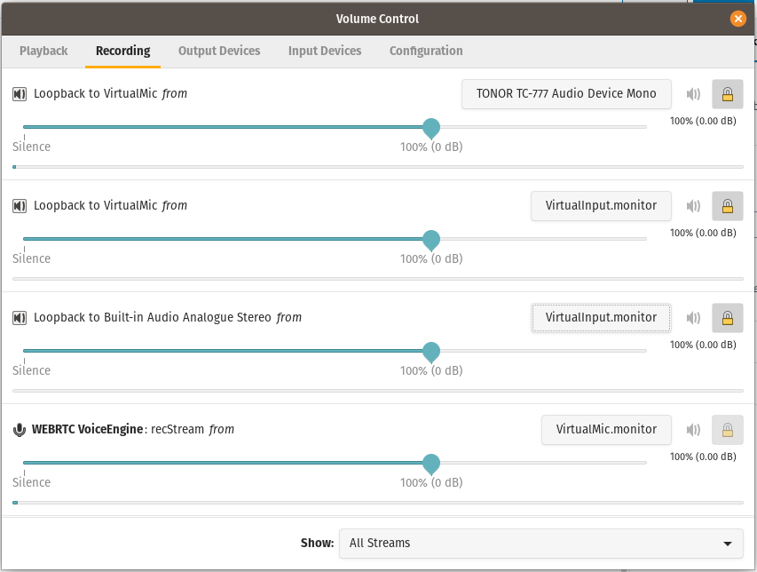
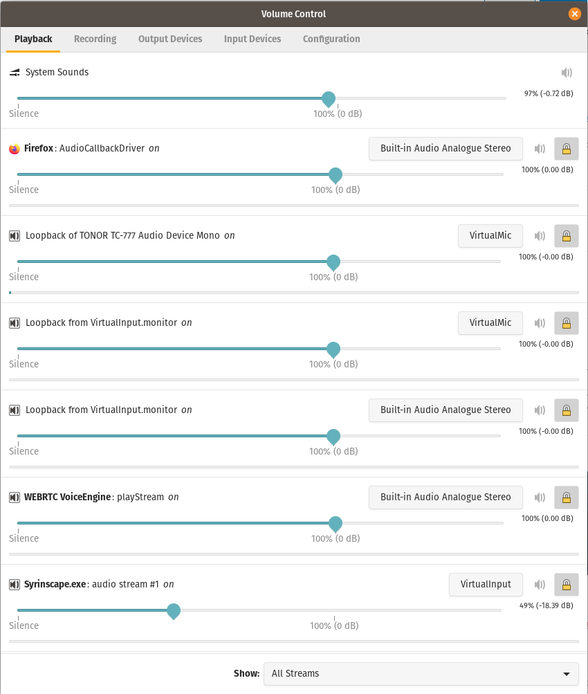
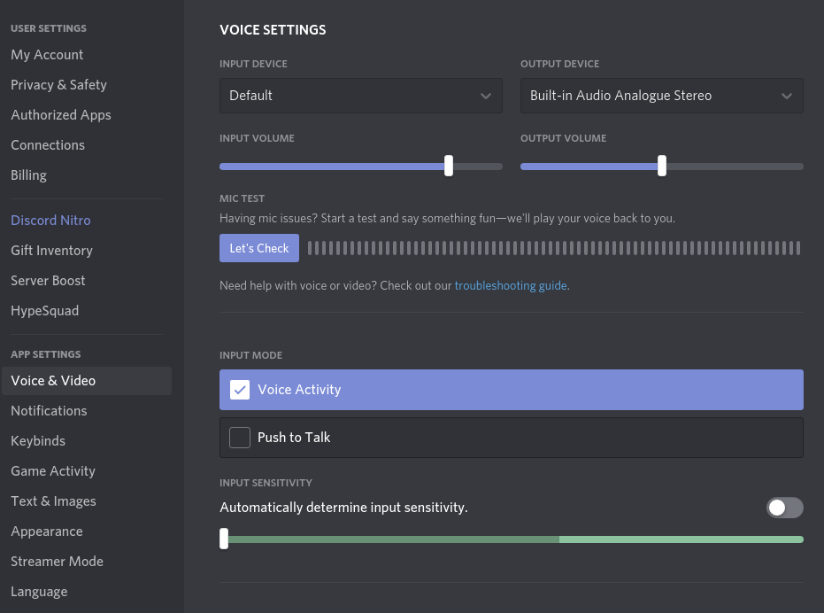

I'm a Dungeon Master! I don't mean that in the S&M sense! As in the game Dungeons & Dragons ([https://dnd.wizards.com](https://dnd.wizards.com)), where I run a weekly game as well as take part in a couple of campaigns as a player. It's a lot of fun and something I would definitely recommend you have a go at if you are so inclined

[](https://discord.com)

There is a vast amount of tooling & tech out there that allows you to play remotely such as Virtual Table Tops, Character builders, online resources, etc. One such tool that gets used quite often is a chat service called Discord ([https://discord.com](https://discord.com)) It's really useful and allows you to easily be part of and manage communities of people.... Think IRC & Slack, but more up to date than IRC and less "workish" than Slack.

As part of my online games I like being able to have ambient music to match the surroundings the players are traveling through, as well as some active elements thrown in for good measure. This is possible in a few different ways using discord but the way I want to set it up can be somewhat frustrating to set up. Let me explain:

[](https://syrinscape.com)

I have taken a shine to two tools in particular... Syrinscape ([https://syrinscape.com](https://syrinscape.com)) and Table Top Audio ([https://tabletopaudio.com](https://tabletopaudio.com)). The former being a windows app with an nice interactive mixing UI that allows you to combine and generate unique sounds, the latter being a lovely web service that has some fantastic loop-able ambient background tracks all 100% free.

[](https://tabletopaudio.com)

I am wanting to be able to pipe the audio from these two services into my Discord server so that I can make use of the fantastic audio they offer. This is the journey of how I managed to get this working, partly as a reminder for me if I ever need to do this again and also to help others that may be looking to do the same.

## My Setup

I've been a big fan of Ubuntu for a number of years, but since 20.04 I've found that the shine I've had for it has waned significantly. I wont go into the why and wherefore of it but I'm now running the excellent Pop\_OS! from System76 ([https://pop.system76.com](https://pop.system76.com)) its an Ubuntu variant but with the bits I dislike removed. So assume that anything I'm doing is compatible with Ubuntu 20.04.

## The Requirements

The ideal solution should see me being able to have a single instance of discord running that allows me to still use my mic to be able to talk, and to have my selected background playing with the ability to control the volumes of both the mic and the background independently.

## Finding A Solution

A lot of googling led me to realise that there isn't a perfect solution to fit my brief. The hardest part being not actually knowing what to google and a lot of the terminology being somewhat foreign to me as I'm not much of an audio engineer. However I finally stumbled upon a [blog post](https://endless.ersoft.org/pulseaudio-loopback/) by Emma Anderson dated June 2016 and thankfully it gives me a lot of the heavy lifting that I needed along with some explanation of what I'm trying to achieve, though I'm hopefully going to be more verbose here in what this all means and how it works.

## PulseAudio

The first thing we need to do is make sure the packages for `pulseaudio` and `pavucontrol` are installed. These will allow us to manipulate the way we capture sound and redirect it to the appropriate inputs and outputs.

```
apt install pulseaudio pavucontrol
```

## Virtual Input & Virtual Mic

What we are going to try to achieve, is to create two new elements inside of Pulseaudio;

1. a Virtual input that we can channel the applications creating our background sounds which will allow us to control the volume independently.
2. a Virtual Microphone that we can channel our both our normal microphone and the new Virtual input into.

By creating these elements we can then use the `pavucontrol` tool to select what needs to be redirected where. so lets get started.

```bash
pactl load-module module-null-sink sink_name=VirtualInput
pacmd update-sink-proplist VirtualInput device.description=VirtualInput
pacmd update-source-proplist VirtualInput.monitor device.description=VirtualInput.monitor
```

Here we have two commands, the first will create our new Virtual Input as what is referred to as a "null sink". This on its own is not really very useful for us as we also need what is referred to as a "source", thankfully when we run this command it also created a new "source" for us.

On it's own that should be more than enough, but running the 2nd & 3rd command makes our live a lot easier because it will apply some very useful labels to both of the newly created sink and source. In this case `VirtualInput` for the sink and `VirtualInput.monitor` for the source. Having these in place makes it a lot simpler to configure things with `pavucontrol`.

Next we need to create our Virtual Mic using some very familiar looking commands.

```
VM=$(pactl load-module module-null-sink sink_name=VirtualMic)
pacmd update-sink-proplist VirtualMic device.description=VirtualMic
pacmd update-source-proplist VirtualMic.monitor device.description=VirtualMic.monitor
```

again we have now created a new new pair of sink and source with some nice easy to recognise labels that we will use when we start working with `pavucontrol`.

The next piece to our puzzle is creating the components that will let us define a connection from the `VirtualInput` and our physical microphone to the newly created `VirtualMic`. We do this with two identical commands;

```
pactl load-module module-loopback sink=VirtualMic
pactl load-module module-loopback sink=VirtualMic
```

we now have most of the elements that we need to configure everything to work.

## Listening to my own Ambience

Before we can start wiring it all together we need to ensure we can also listen back to our own ambience. This involves us creating one more "loopback" module that points to the speakers we are wanting to listen to. Lets find out what our options are by running;

```bash
pacmd list-sinks | awk '/index:/ {print $0}; /name:/ {print $0}; /device.description/ {print $0}
```

This lists all of the available "sinks" that we can use. on my daily driver laptop I get;

```bash
  * index: 1
	name: <alsa_output.pci-0000_00_1f.3.analog-stereo>
		device.description = "Built-in Audio Analogue Stereo"
```

This tells us the "index" for the device, its name and also some kind of description. The important bit for us here is the name as we will need that to create our new "loopback" with the command;

```bash
pactl load-module module-loopback sink=alsa_output.pci-0000_00_1f.3.analog-stereo
```

This creates the last piece for our puzzle!

## Connecting it all together

I'm now going to assume you have logged yourself into the Discord client and fired up your copy of Syrinscape... but you should just as easily swap out these for something else of your choice.

Now we can start `pavucontrol` either from the command line or you can look for it in your applications menu. Once it loads you will hopefully be presented with something that looks like;



For this next step I am specifically starting on the "Recording" tab of `pavucontrol` this is to allow us to set up what is going to be captured. I have updated the drop-down at the bottom left to show "All Streams" as this will make it quicker to configure… Starting at the top we have two entries for;

**Loopback to VirtualMic from**: These are the result of the first two "loopback" modules we created with the `pactl` command we ran previously. They are going to allow us to capture the audio streams from our physical microphone, mine here is the `TONOR TC-777` and our newly created `VirtualMic`.

followed by a single entry for;

**Loopback to Built-in-Audio Analougue Stereo from**: which is the last "loopback" module that we create to let us hear our own Ambience, Having this set to our `VirtualInput` means that anything that pipe into our `VirtualInput` will also come out of our speakers.

and finally;

**WEBRTC VoiceEngine**: Once you connect to a voice channel in discord this will appear and it allows us to specify which of our devices it should be reading the audio feed from. For our purposes we have this set to our VirtualMic so that we can have our mixed audio feeds

Now that recording is configured we can sort out our playback.



Here we can see the "Playback" tab of `pavucontrol`, again set to show "All Streams". This time I'm going to run through the elements here starting from the bottom of the list and working my way up...

**WEBRTC VoiceEngine**: This again is our connection to a Discord voice channel, as you can see I have this set to play back all of its output via `Built-in Audio Analogue Stereo` which is how my Operating system has labelled my physical speakers.

**Syrinscape.exe**: This is the Syrinscape application, that I run through PlayOnLinux ([https://www.playonlinux.com](https://www.playonlinux.com)), and I will use to generate all of my lovely ambient sounds. This is set to play all of its "audio stream" on our `VirtualInput`.

The next two items in our list, providing you have configured the Recording tab first should look as in the image. Changing the "Loopback to VirtualMic" entries on the Recording tab will change the labels of these two entries.

**Loopback of VirtualInput.monitor on**: it seems we have two of these entries and where we can tell the to pip all of the audio we are now capturing on our `VirtualInput` In this case we want it to go to two places, our `VirtualMic` so that it can be sent to both our Discord audio channel and also to our `Built-in Audio Analogue Stereo` speakers.

**Loopback of Built-in Audio Analogue Stereo on**: is where we now direct the input from our physical microphone and feed that straight into our `VirtualMic`.

The other entries in the list here are for firefox and the system itself and are not relevant to what we are trying to achive.

## Winner Winner Chicken Dinner

That's is effectively all we need to do... From here on in anything you play via the Syrinscape app will be merged with your microphone input and passed to Discord. You can then use the volume sliders in `pavucontrol` to adjust the levels of all the inputs to suit your own personal preference.

Though I will make a few small suggestions about how to configure your discord settings. You shouldn't need to make any adjustments to the input and output devices which should now be set to `Default` as your "Input Device" if you change this it will override the changes we have made and you will need to go back to the Recording tab of `pavucontrol` and switch **WEBRTC VoiceEngine** back to InputMic , but...



I would recommend disabling automatic input sensitivity and lowering the sensitivity slider all the way down to -100dB... this is to allow for the potential low and subtle tones and ambient elements you may want to play... be warned though it makes it very very easy for an low quality microphone (such as the `Built-in Audio Analogue Stereo` microphone found on my laptop) to pick up other noises such as your systems fans, mouse clicks and typing. A simple way to combat this is to get a reasonable quality external cardioid condenser microphone which eliminates a lot of this unwanted background.

## One last thing

That should be it for now... I'll leave you with one final thing. This is a simple little bash script I threw together that I run in can a terminal to create all the components and if I want will then clean them all up and remove them. If you really want you could set it up as a permanent implementation, but I'll let you google for that solution!

```bash
#!/bin/bash

LB1=""

listenback() {
    echo ""
    echo "Listing all possible output devices"
    pacmd list-sinks | awk '/index:/ {print $0}; /name:/ {print $0}; /device\.description/ {print $0}'
    echo ""
    echo "Please enter the name of the output device to create a loopback for (leave blank to skip): "
    read S1
    if [ "$S1" != "" ]; then
    	echo " * Creating Loopback for '$S1'"
    	LB1=$(pactl load-module module-loopback sink="$S1")
    fi
}

cleanup() {
    while true; do
        read -p "Finished? do you want to clean up and remove modules [Yn]: " yn
        case $yn in
            [Yy]* ) return 0;;
            [Nn]* ) return 1;;
            * ) echo "Please answer yes or no.";;
        esac
    done
}

listenback

echo " * Creating VirtualInput"
VI=$(pactl load-module module-null-sink sink_name=VirtualInput)
pacmd update-sink-proplist VirtualInput device.description=VirtualInput
pacmd update-source-proplist VirtualInput.monitor device.description=VirtualInput.monitor

echo " * Creating VirtualMic"
VM=$(pactl load-module module-null-sink sink_name=VirtualMic)
pacmd update-sink-proplist VirtualMic device.description=VirtualMic
pacmd update-source-proplist VirtualMic.monitor device.description=VirtualMic.monitor

echo " * Creating loopbacks for VirtualMic"
VML1=$(pactl load-module module-loopback sink=VirtualMic)
VML2=$(pactl load-module module-loopback sink=VirtualMic)


echo "All modules have been loaded have been configured! Run pavucontrol to configure your devices."

if cleanup; then
    pactl unload-module "$VML2"
    pactl unload-module "$VML1"
    pactl unload-module "$VM"
    pactl unload-module "$VI"
    if [ $LB1 != "" ]; then
        pactl unload-module "$LB1"
    fi
    echo "All modules have been unloaded"
else 
    if [ $LB1 != "" ]
    then
        echo "Modules $LB1, $VI, $VM, $VML1 & $VML2 remain loaded"
    else
    	echo "Modules $VI, $VM, $VML1, & $VML2 remain loaded"
    fi
fi
```
